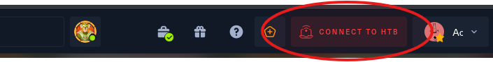

# Bart volledige tutorial

### 0 Verbinden met VPN

1: Op de website van HackTheBox drukken we op "Connect to HTB"&#x20;

<figure><figcaption></figcaption></figure>

2: Vervolgens drukken we op Machines

<figure><figcaption></figcaption></figure>

3: Nu drukken we op download VPN

<figure><figcaption></figcaption></figure>

4: We krijgen een VPN bestand, druk op de folder op de folder te openen waar het in staat.

<figure><figcaption></figcaption></figure>

5: We drukken op de rechtermuisknop in deze folder en vervolgens op open terminal here

<figure><figcaption></figcaption></figure>

6: Nu typen we&#x20;

```
openvpn <naam van het .ovpn bestand>
```

<figure><figcaption></figcaption></figure>

7: Als we "Initialization Sequence Completed" zien dat weten we dat we verbonden zijn!

<figure><figcaption></figcaption></figure>

### 1 NMAP

<figure><figcaption></figcaption></figure>

1: Ik open een nieuwe terminal&#x20;

2: ik maak een directory genaamd bart waar ik alles in ga uitvoeren. Ik doe dit met mkdir en de vlag -p zodat ik in 1 keer alle tussen directories ook maak. mocht /htb niet bestaan dan wordt die ook aangemaakt. met ; plak ik gelijk een 2e commando er achter namelijk cd dus dan ga ik naar die directory.

```
mkdir -p /root/htb/bart;cd /root/htb/bart
```

3: Ik voer een volledige nmap scan uit. Ik check alle poorten (65k+ poorten) met -p- en met -A voer ik een groot aantal nmap scans uit waaronder versie detectie, os detectie en standaard scripts. dit doe ik om zoveel mogelijk info te verzamelen. Het stukje -oX en --stylesheet. zorgt ervoor dat ik een mooie output krijg aan het einde.

```
nmap -A -p- 10.10.10.81 -oX nmapout --stylesheet https://raw.githubusercontent.com/honze-net/nmap-bootstrap-xsl/master/nmap-bootstrap.xsl
```

4: Output bekijken door middel van het nmapout bestand te openen met firefox

```
firefox nmapout
```

5: De output laat ons zien dat alleen poort 80 open staat

<figure><figcaption></figcaption></figure>

6: We zien ook onder het kopje "http-title" zien we een redirect naar

```
Did not follow redirect to http://forum.bart.htb/
```

7: Dit is een subdomain dus laten we dit toevoegen aan onze /etc/hosts bestand en ook gelijk het main domain toevoegen namelijk "bart.htb"&#x20;

<figure><figcaption></figcaption></figure>

<figure><figcaption></figcaption></figure>

8: Laten we gelijk ook een subdomain bruteforce doen om te zien of er meer dan alleen forum.bart.htb bestaat maar meschien ook een admin.bart.htb bijvoorbeeld. Hiervoor kunnen we gobuster gebruiken en een woordelijst.

```
gobuster dns -d bart.htb -w /usr/share/seclists/Discovery/DNS/subdomains-top1million-110000.txt -t 50
```

